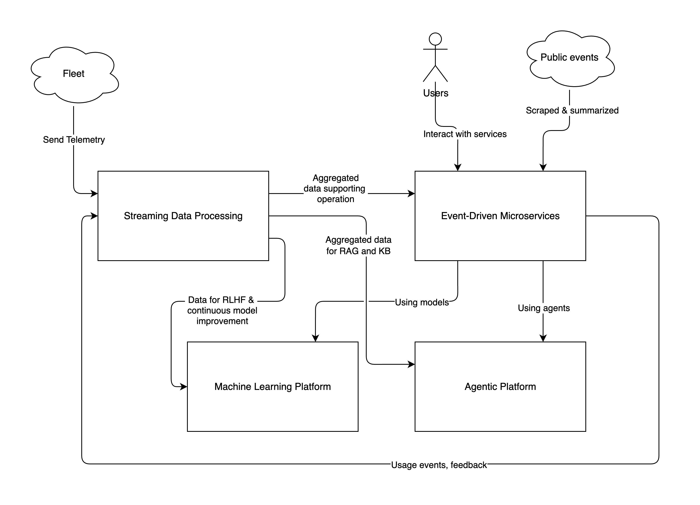

# ADR-001: Combine Microservices, Streaming, and Agentic Architectures for the holistic solution

## Status

**Accepted** | Date: 2025-10-20

## Context

The MobilityCorp system must address multiple use case at the same time, including processing real-time data from the
vehicles fleet (telemetry), user feedback and uploads, autonomous decision-making using generative AI, and scalable
service delivery for the end-users.

### Requirements

- The system must handle a current fleet of ~280,000 vehicles sending telemetry data every 30 seconds. The system must
  be ready for scale (more countries, more vehicles in each country, more frequent telemetry).
- The system must utilize generative AI to provide autonomous decision-making capabilities for route optimization,
  predictive maintenance, and user interaction. This implies using Gen-AI specific technologies, such as RAG (
  Retrieval-Augmented Generation), guardrails, and nondeterministic prompt filtering.
- The system must maintain high availability and low latency for end-user services, ensuring a seamless experience.
  Users should conceive the service as extremely-reliable, so the the MobilityCorp can have a foundation for winning in
  a competitive market.

## Decision

We will use a hybrid architecture that combines microservices, streaming data processing, and agentic architecture to
fulfil the requirements.

The **Event-Driven Microservices architecture** will provide a robust reliable Sservice for the end-users and company
operators. It will feature modularity, scalability, and maintainability and guarantee high availability for the system.

The **Streaming Data Processing** component will handle the real-time telemetry data from the vehicles, customer
feedback, uploads (such as photos of returned vehicles), etc. This component will process different data per use case,
backing the following use cases with near-real-time data:

- Fleet observability and monitoring
- Predictive maintenance and stocking
- Automatic validation of returned vehicles photos through reinforced machine learning
- Customer feedback analysis

The **Agentic Architecture** will be used to implement the generative AI capabilities required for autonomous
decision-making. This architecture will allow the system to utilize multiple AI agents that can interact with each
other and with external systems to perform complex tasks such as route optimization, predictive maintenance, and user
interaction. The system will benefit from existing well-established platforms to guarantee best-in-class adherence to
the responsible usage of AI.

Certain use cases will require the usage of specifically-trained machine learning models. To give a few examples:

- vehicle damage detection from photos
- parking violation detection from photos and GPS data
- predictive positioning models based on telemetry data and demand

These models will be trained and deployed on a dedicated machine learning platform and integrated with the microservices
architecture for execution.

### Approach

The picture below illustrates how the components will be physically organized and interact with each other.
This doesn't affect the domain-based separation or grouping of services.

At this image you can see:

1. The fleet is sending telemetry data to the Streaming Data Processing component, which is analyzed via several
   workflows for various purposes. The processed data is then stored in databases accessible by the microservices,
   machine learning platform, and agentic architecture.
2. The microservices emit operational events to the streaming platform, which are processed and stored for analytics and
   reporting.
3. The microservices emit content-related events to the agentic architecture, which uses them to inform AI agents for
   decision-making.
4. The machine learning platform provides trained models to the microservices and agentic architecture for specific
   tasks.
5. The agentic architecture interacts with the microservices to perform actions based on AI decisions.

### Rationale

Using dedicated architectures for different concerns allows us to optimize each part of the system for its specific requirements. This way we utilize the strengths of each architectural style while mitigating their weaknesses.

## Consequences

A dedicated architecture unlocks the complete toolset for each concern, allowing us to build a best-in-class system.
For example, microservices architecture provides scaling and fault isolation for end-user services, while streaming data
processing enables real-time analytics and responsiveness to telemetry data. The agentic architecture allows us to
leverage existing generative AI capabilities and toolkit effectively.

---

**Template Version**: 1.0 (Based
on [Michael Nygard's ADR format](https://cognitect.com/blog/2011/11/15/documenting-architecture-decisions))