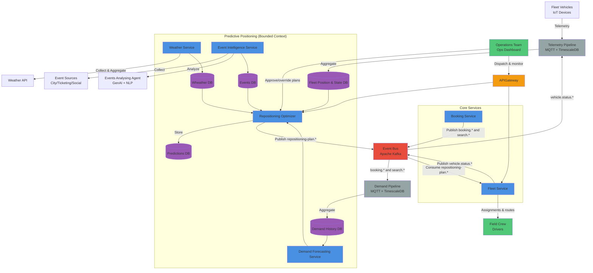

# Predictive Fleet Positioning

Allowing purely on "natural" (usage-driven) distribution of the fleet is suboptimal, because small spikes, like popular
events, peak hours, etc., can lead to poor service levels. Predictive fleet positioning aims to anticipate demand and
position vehicles accordingly.

The following aspects are considered for positioning decisions:

- Current demand and short-term prediction based on statistical models
- Historical demand patterns (time of day, day of week, day of the year, repetitive events, such as holidays, etc.)
- Real-time events (e.g., concerts, sports events) that may influence demand
- External factors (e.g., weather conditions, public transport disruptions, social situation)

Fleet repositioning has the following goals:

- Supply the demand, reducing customer wait times
- Optimize fleet utilization, reducing idle times and increasing revenue
- Preserving fleet from damages in case of expected adverse weather conditions or harsh social events, such as protests,
  football matches, etc.

## How it works

1. Current fleet state and positioning is collected, aggregated by a **streaming data platform**.
2. Weather condition is periodically collected by a dedicated microservice.
3. Social and entertainment events are collected from external sources by a dedicated scraping microservice. Data is analyzed using LLMs to extract potential impact on demand. Structured data is stored in a database and served to a prediction model.
4. A **prediction engine** (microservice) combines all the data and generates positioning recommendations using a deterministic statistical models.
5. Recommendations are sent to a **fleet management microservice**, which translates them into concrete repositioning tasks for vehicles and drivers.

The following diagram illustrates the cooperation between components:

