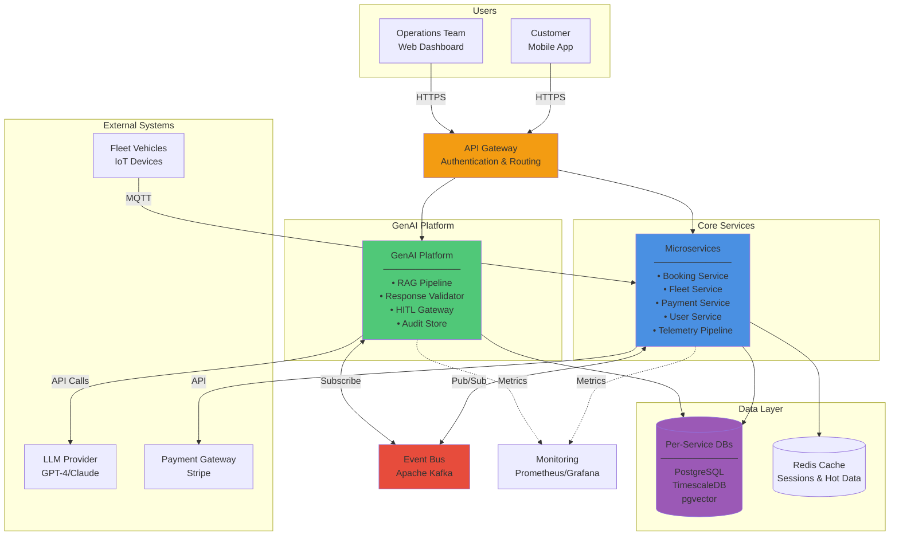

# Container Diagram - MobilityCorp System

## Description

This diagram shows the high-level technical building blocks (containers) of the MobilityCorp platform. It illustrates the microservices architecture with the GenAI Platform as a bounded context, event-driven communication, and data storage strategy.

**Note:** Services and databases are shown as grouped boxes for readability. Each box represents multiple independent components following microservices and database-per-service patterns.

## Key Containers

### Frontend

- **Mobile App**: React Native application for iOS and Android
- **Web Dashboard**: React-based operations dashboard

### API Layer

- **API Gateway**: Entry point for all external requests, handles authentication, rate limiting

### Core Services (Microservices)

- **User Service**: Authentication, profiles, and ride history (Node.js)
- **Booking Service**: Reservations, trip lifecycle, and pricing (Node.js)
- **Availability Service**: Vehicle search and real-time availability (Go)
- **Fleet Service**: Vehicle inventory, locations, and maintenance (Go)
- **Payment Service**: Payment processing and billing (Node.js)

**See:** [Core Services Container Diagram](core-services/core-services-container-diagram.md) for detailed service architecture

### GenAI Platforms (Bounded Context)

- **GenAI Platform**: AI-powered features with RAG, runtime validation, and HITL controls

### Infrastructure

- **Event Bus**: Event streaming for async, decoupled communication
- **Databases**: Per-service databases (PostgreSQL, MongoDB)
- **Cache**: Redis for session and frequently accessed data
- **Monitoring**: Observability stack (Prometheus, Grafana)
- **Telemetry Pipeline**: MQTT broker + TimescaleDB for IoT data ingestion (infrastructure, not a service)

## Diagram

## Technology Choices

### Frontend

- **React Native**: Cross-platform mobile development (iOS + Android from single codebase)
- **React**: Modern, component-based web dashboard

### Backend

- **Node.js/TypeScript**: Fast, event-driven for core business services
- **Python/FastAPI**: Optimal for GenAI Platform with ML library ecosystem

### Data Storage

- **PostgreSQL**: Primary relational database for core services
- **TimescaleDB**: Optimized time-series database for telemetry
- **pgvector**: Vector extension for RAG retrieval index
- **Redis**: In-memory cache for sessions and hot data

### Integration

- **Apache Kafka**: Event streaming for async, decoupled communication
- **MQTT**: Lightweight protocol for vehicle IoT communication

### Observability

- **Prometheus**: Metrics collection
- **Grafana**: Visualization and dashboards
- **OpenTelemetry**: Distributed tracing

## Key Architectural Patterns

1. **Microservices**: Each service owns its domain and database
2. **Event-Driven**: Services communicate via events for loose coupling
3. **API Gateway**: Single entry point for authentication and routing
4. **Bounded Context**: GenAI Platform isolated with strict interfaces
5. **Database per Service**: Each service has its own database for autonomy

## References

- See [GenAI Component Diagram](../genai-subsystem/genai-component-diagram.md) for detailed GenAI Platform internals
- See [Core Services Container Diagram](core-services/core-services-container-diagram.md) for detailed core services architecture
- See [Deployment Diagram](../deployment/deployment-diagram.md) for infrastructure and hosting
- See [ADR-001](../../../Architecture-Decision-Records/001-microservices-architecture.md) for architecture style rationale
- See [ADR-002](../../../Architecture-Decision-Records/002-event-driven-backbone.md) for event-driven architecture rationale
- See [ADR-003](../../../Architecture-Decision-Records/003-core-services-decomposition.md) for core services decomposition rationale
