# Core Services Container Diagram

## Description

This diagram provides a detailed view of the **Core Services** layer of the MobilityCorp platform, showing the individual microservices, their responsibilities, inter-service communication patterns, and data storage strategies.

## Core Services Overview

Each service is independently deployable, owns its data, and communicates via events and REST APIs.

| Service                  | Responsibility                                    | Technology Stack  | Database             |
| ------------------------ | ------------------------------------------------- | ----------------- | -------------------- |
| **User Service**         | Authentication, profiles, preferences             | Node.js + Express | PostgreSQL           |
| **Booking Service**      | Reservations, trip lifecycle, pricing             | Node.js + Express | PostgreSQL + Redis   |
| **Fleet Service**        | Vehicle inventory, locations, maintenance         | Go + Fiber        | PostgreSQL + PostGIS |
| **Availability Service** | Vehicle search, real-time availability, proximity | Go + Fiber        | PostgreSQL + Redis   |
| **Payment Service**      | Payment processing, billing, refunds              | Node.js + Express | PostgreSQL           |

## Diagram

```mermaid
graph TB
    subgraph "External"
        MobileApp[Mobile App<br/>React Native]
        Dashboard[Ops Dashboard<br/>React]
        Vehicles[IoT Vehicles<br/>Fleet Devices<br/>MQTT Clients]
        PaymentGW[Payment Gateway<br/>Stripe]
        Maps[Map Services<br/>Google Maps]
    end

    TelemetryPipeline[Telemetry Pipeline<br/>────────────<br/>MQTT Broker<br/>TimescaleDB<br/>IoT Data Ingestion]

    APIGateway[API Gateway<br/>────────────<br/>• Authentication<br/>• Rate Limiting<br/>• Routing]

    subgraph "Core Microservices"
        UserService[User Service<br/>────────────<br/>• Authentication<br/>• User profiles<br/>• Preferences<br/>• Ride history]

        BookingService[Booking Service<br/>────────────<br/>• Reservations<br/>• Trip lifecycle<br/>• Dynamic pricing<br/>• Billing triggers]

        AvailabilityService[Availability Service<br/>────────────<br/>• Vehicle search<br/>• Real-time availability<br/>• Proximity search<br/>• Geospatial queries]

        FleetService[Fleet Service<br/>────────────<br/>• Vehicle inventory<br/>• Locations & status<br/>• Maintenance scheduling<br/>• Fleet analytics]

        PaymentService[Payment Service<br/>────────────<br/>• Payment processing<br/>• Billing & invoicing<br/>• Refunds<br/>• Transaction history]
    end

    EventBus[Event Bus<br/>Apache Kafka<br/>────────────<br/>Topics:<br/>• booking.*<br/>• vehicle.status.*<br/>• payment.*<br/>• incident.*<br/>• user.engagement.*]

    subgraph "Data Layer"
        UserDB[(User DB<br/>PostgreSQL)]
        BookingDB[(Booking DB<br/>PostgreSQL)]
        AvailabilityDB[(Availability DB<br/>PostgreSQL<br/>+ PostGIS)]
        FleetDB[(Fleet DB<br/>PostgreSQL)]
        PaymentDB[(Payment DB<br/>PostgreSQL)]
        Cache[(Redis Cache<br/>Sessions<br/>Availability<br/>Hot Data)]
    end

    subgraph "Cross-Cutting"
        Monitoring[Monitoring<br/>Prometheus + Grafana]
        Tracing[Distributed Tracing<br/>Jaeger + OpenTelemetry]
    end

    %% External to API Gateway
    MobileApp -->|HTTPS| APIGateway
    Dashboard -->|HTTPS| APIGateway

    %% IoT Vehicles to Telemetry Pipeline
    Vehicles -->|MQTT<br/>Telemetry Data| TelemetryPipeline

    %% API Gateway to Services
    APIGateway --> UserService
    APIGateway --> BookingService
    APIGateway --> AvailabilityService
    APIGateway --> FleetService
    APIGateway --> PaymentService

    %% Service to Service (Sync)
    BookingService -->|REST: Check availability| AvailabilityService
    BookingService -->|REST: Verify user| UserService
    BookingService -->|REST: Process payment| PaymentService
    BookingService -->|REST: Send vehicle command| FleetService
    AvailabilityService -->|REST: Get route/ETA| Maps
    FleetService -->|REST: Query telemetry| TelemetryPipeline
    FleetService -->|MQTT: Vehicle commands| Vehicles

    PaymentService -->|REST: Charge/Refund| PaymentGW

    %% Event-Driven Communication
    UserService -->|Publish: user.registered<br/>user.engagement.*| EventBus
    BookingService -->|Publish: booking.created<br/>booking.completed<br/>booking.cancelled| EventBus
    FleetService -->|Publish: vehicle.status.changed<br/>vehicle.maintenance.scheduled| EventBus
    PaymentService -->|Publish: payment.processed<br/>payment.failed| EventBus

    EventBus -->|Subscribe: vehicle.status.*| AvailabilityService
    EventBus -->|Subscribe: booking.*| AvailabilityService
    EventBus -->|Subscribe: booking.*| FleetService
    EventBus -->|Subscribe: booking.completed| PaymentService
    EventBus -->|Subscribe: payment.*| BookingService

    %% Data Access
    UserService --> UserDB
    BookingService --> BookingDB
    AvailabilityService --> AvailabilityDB
    FleetService --> FleetDB
    PaymentService --> PaymentDB

    BookingService --> Cache
    AvailabilityService --> Cache
    UserService --> Cache

    %% Observability
    UserService -.->|Metrics + Traces| Monitoring
    BookingService -.->|Metrics + Traces| Monitoring
    AvailabilityService -.->|Metrics + Traces| Monitoring
    FleetService -.->|Metrics + Traces| Monitoring
    PaymentService -.->|Metrics + Traces| Monitoring

    UserService -.->|Spans| Tracing
    BookingService -.->|Spans| Tracing
    AvailabilityService -.->|Spans| Tracing
    FleetService -.->|Spans| Tracing
    PaymentService -.->|Spans| Tracing

    %% Styling
    style UserService fill:#4A90E2
    style BookingService fill:#4A90E2
    style AvailabilityService fill:#4A90E2
    style FleetService fill:#4A90E2
    style PaymentService fill:#4A90E2
    style Vehicles fill:#E8E8E8
    style TelemetryPipeline fill:#95A5A6
    style EventBus fill:#E74C3C
    style APIGateway fill:#F39C12
    style Cache fill:#9B59B6
```

## Service Details

### User Service

**Responsibilities:**

- User registration and authentication (JWT-based)
- User profile management (personal info, preferences)
- Ride history and statistics
- User segmentation for personalization

**Key APIs:**

- `POST /auth/register` - New user registration
- `POST /auth/login` - User authentication
- `GET /users/{id}` - Get user profile
- `GET /users/{id}/rides` - Get ride history
- `PUT /users/{id}/preferences` - Update preferences

**Events Published:**

- `user.registered` - New user signup
- `user.engagement.app_opened` - User activity tracking
- `user.preferences.updated` - Profile changes

**Database:** PostgreSQL (users, profiles, preferences)

---

### Booking Service

**Responsibilities:**

- Reservation management (create, cancel, expire)
- Trip lifecycle (start, pause, end)
- Dynamic pricing calculation
- Billing triggers

**Key APIs:**

- `POST /bookings` - Create reservation
- `POST /bookings/{id}/start` - Start trip
- `POST /bookings/{id}/end` - End trip
- `DELETE /bookings/{id}` - Cancel reservation
- `GET /bookings/{id}` - Get booking details
- `GET /users/{id}/bookings` - Get user's bookings

**Events Published:**

- `booking.created` - New reservation
- `booking.started` - Trip started
- `booking.completed` - Trip ended
- `booking.cancelled` - Reservation cancelled

**Events Subscribed:**

- `payment.processed` - Confirm payment
- `payment.failed` - Handle payment failure

**Database:** PostgreSQL (bookings, trips, pricing rules)
**Cache:** Redis (active bookings, pricing cache)

---

### Fleet Service

**Responsibilities:**

- Vehicle inventory management
- Real-time vehicle locations and status
- Maintenance scheduling
- Fleet analytics and reporting
- Consume telemetry data for status updates

**Key APIs:**

- `GET /vehicles/{id}` - Get vehicle details
- `PUT /vehicles/{id}/status` - Update vehicle status
- `POST /vehicles/{id}/lock` - Lock vehicle
- `POST /vehicles/{id}/unlock` - Unlock vehicle
- `GET /vehicles/{id}/maintenance` - Get maintenance schedule
- `POST /vehicles/{id}/command` - Send command to vehicle (lock/unlock)

**Events Published:**

- `vehicle.status.changed` - Status updates (available, in-use, maintenance, out-of-service)
- `vehicle.maintenance.scheduled` - Maintenance needed
- `vehicle.location.updated` - Location updates

**Events Subscribed:**

- `booking.created` - Track vehicle usage
- `booking.completed` - Update vehicle availability

**Database:** PostgreSQL with PostGIS extension (vehicles, maintenance, locations)
**External Integration:** Telemetry Pipeline (query for historical data and analytics)

---

### Availability Service

**Responsibilities:**

- Real-time vehicle availability search
- Proximity-based vehicle discovery (geospatial queries)
- Complex availability calculations (battery, status, reservations)
- High-performance read-optimized queries
- Materialized view of vehicle availability

**Key APIs:**

- `GET /vehicles/search` - Find available vehicles by location
- `GET /vehicles/nearby` - Find vehicles within radius
- `POST /vehicles/available` - Check if specific vehicle is available
- `GET /availability/summary` - Get availability statistics by area

**Events Published:**

- (None - read-only service)

**Events Subscribed:**

- `vehicle.status.changed` - Update availability cache
- `booking.created` - Mark vehicle as reserved
- `booking.completed` - Mark vehicle as available
- `booking.cancelled` - Return vehicle to available pool

**Database:** PostgreSQL with PostGIS extension (materialized availability view)
**Cache:** Redis (aggressive caching with 10-second TTL for hot availability data)

**Rationale for Separate Service:**

- **High query volume**: Most frequent operation in the system
- **Different scaling profile**: Read-heavy vs. Fleet Service (write-heavy)
- **Performance optimization**: Specialized indexes and caching strategies
- **Query complexity**: Geospatial + availability logic + user preferences

---

### Payment Service

**Responsibilities:**

- Payment method management
- Payment processing via external gateway
- Refund handling
- Billing and invoicing
- Transaction history

**Key APIs:**

- `POST /payment-methods` - Add payment method
- `POST /payments` - Process payment
- `POST /refunds` - Issue refund
- `GET /payments/{id}` - Get payment status
- `GET /invoices/{userId}` - Get user invoices

**Events Published:**

- `payment.processed` - Successful payment
- `payment.failed` - Failed payment
- `refund.issued` - Refund completed

**Events Subscribed:**

- `booking.completed` - Trigger payment
- `booking.cancelled` - Release hold

**Database:** PostgreSQL (payments, refunds, invoices)
**External Integration:** Stripe API (PCI-DSS compliant)

---

## Infrastructure Components

### Telemetry Pipeline

**Purpose:** High-volume IoT data ingestion and time-series storage

**Components:**

- **MQTT Broker**: Lightweight protocol for vehicle telemetry (location, battery, speed, sensors)
- **TimescaleDB**: Optimized time-series database for telemetry storage
- **Data Retention**: 7 days hot storage, 90 days cold storage

**Data Flow:**

1. **Inbound**: IoT vehicles publish telemetry data to MQTT broker

   - Topics: `vehicles/{id}/telemetry`, `vehicles/{id}/status`, `vehicles/{id}/diagnostics`
   - Frequency: Every 10-30 seconds per vehicle
   - Data: GPS coordinates, battery level, speed, lock status, sensors

2. **Storage**: MQTT broker → TimescaleDB ingestion pipeline

   - Buffering for high-volume bursts
   - Data validation and cleansing
   - Time-series optimized storage

3. **Outbound**: Services query historical telemetry via REST API
   - Fleet Service: Analytics, maintenance predictions
   - GenAI Platform: Incident context, anomaly detection
   - Analytics Service: Reporting and insights

**Bidirectional Communication:**

- **Vehicle → Platform**: Telemetry data (MQTT publish)
- **Platform → Vehicle**: Commands (MQTT publish on command topics)
  - Lock/unlock commands
  - Firmware updates
  - Diagnostic requests

**Why Infrastructure (Not a Service):**

- Pure data ingestion pipeline (no business logic)
- Similar to log aggregation or metrics collection
- Managed infrastructure components
- Services query it for historical data when needed

**Consumed By:**

- Fleet Service (vehicle analytics, maintenance predictions)
- GenAI Platform (incident context, anomaly detection)
- Analytics Service (reporting and insights)

---

## Communication Patterns

### Synchronous (REST APIs)

Used for **request-response** interactions where immediate response is needed:

- **User-facing**: Mobile app requests via API Gateway
- **Service-to-service**: Booking → Fleet (check availability), Booking → Payment (process charge)

**Advantages:**

- Immediate response
- Simple error handling
- Request-scoped transactions

**Disadvantages:**

- Tight coupling
- Services must be available simultaneously
- Cascading failures possible

---

### Asynchronous (Event-Driven via Kafka)

Used for **fire-and-forget** and **eventual consistency** scenarios:

- **Service-to-service**: Booking publishes `booking.completed` → Fleet subscribes to update availability
- **Audit trail**: All events logged for compliance
- **Analytics**: Analytics service subscribes to all events for data warehouse

**Advantages:**

- Loose coupling
- Services can process at their own pace
- Natural audit trail
- Scalable (buffer during spikes)

**Disadvantages:**

- Eventual consistency
- More complex debugging
- Requires correlation IDs for tracing

---

## Data Management Strategy

### Database per Service

Each service owns its database—**no shared databases**.

**Benefits:**

- Service autonomy (independent deployments)
- Technology choice per service (PostgreSQL, TimescaleDB)
- Clear ownership boundaries

**Challenges:**

- No ACID transactions across services
- Data duplication required (eventual consistency)
- Complex queries span multiple services

**Mitigation:**

- Event-driven data synchronization
- Saga pattern for distributed transactions
- CQRS for complex queries (materialized views)

---

### Caching Strategy

**Redis** is used for:

- **Session management**: User authentication tokens
- **Hot data**: Vehicle availability (TTL: 10 seconds)
- **Active bookings**: In-progress trips for fast access

**Cache invalidation:**

- Event-driven: `vehicle.status.changed` → invalidate cache
- TTL-based: Short TTLs for highly dynamic data

---

## Observability

### Metrics (Prometheus + Grafana)

Each service exposes metrics:

- **Business metrics**: Bookings/sec, active trips, revenue/hour
- **Technical metrics**: Request latency (p50, p95, p99), error rates, throughput
- **Infrastructure metrics**: CPU, memory, DB connections

### Distributed Tracing (Jaeger + OpenTelemetry)

- **Trace ID** propagated across service boundaries
- Visualize end-to-end request flow (e.g., booking creation)
- Identify performance bottlenecks

### Logging

- **Structured JSON logs** (easy to parse)
- **Centralized aggregation** (e.g., ELK stack, CloudWatch)
- **Correlation IDs** for request tracking

---

## Scalability Patterns

### Horizontal Scaling

All services can scale independently:

- **Availability Service**: Scale for high search volume (most frequent operation)
- **Booking Service**: Scale during peak booking hours (morning/evening commute)
- **Fleet Service**: Scale for vehicle management operations
- **Payment Service**: Scale during billing cycles

### Load Balancing

- API Gateway distributes load across service instances
- Kubernetes auto-scaling based on CPU/memory/custom metrics

### Database Scaling

- **Read replicas** for read-heavy services (User, Fleet)
- **Connection pooling** to optimize DB connections
- **Partitioning** for large tables (e.g., telemetry by time)

---

## Failure Handling

### Circuit Breaker Pattern

Prevent cascading failures:

- If Payment Gateway is down → circuit breaker opens
- Queue payments for retry → graceful degradation

### Retry with Exponential Backoff

Transient failures automatically retried:

- Network timeouts
- Temporary service unavailability

### Event Replay

If a service misses events (due to downtime):

- Kafka retains events (30-90 days)
- Service can replay from last offset

---

## Security

### Authentication & Authorization

- **API Gateway**: Validates JWT tokens
- **Service-to-service**: mTLS (mutual TLS) for secure communication
- **RBAC**: Role-based access control (customer, operator, admin)

### Data Security

- **Encryption at rest**: AES-256 for databases
- **Encryption in transit**: TLS 1.3 for all HTTP/HTTPS
- **PCI-DSS compliance**: Payment Service + Gateway

---

## References

- See [Container Diagram](../container/container-diagram.md) for full system overview including GenAI Platform
- See [GenAI Component Diagram](../genai-subsystem/genai-component-diagram.md) for AI subsystem details
- See [Deployment Diagram](../deployment/deployment-diagram.md) for infrastructure
- See [ADR-001: Microservices Architecture](../../../Architecture-Decision-Records/001-microservices-architecture.md)
- See [ADR-002: Event-Driven Backbone](../../../Architecture-Decision-Records/002-event-driven-backbone.md)
- See [ADR-003: Core Services Decomposition](../../../Architecture-Decision-Records/003-core-services-decomposition.md) - **Justification for this diagram's decisions**
