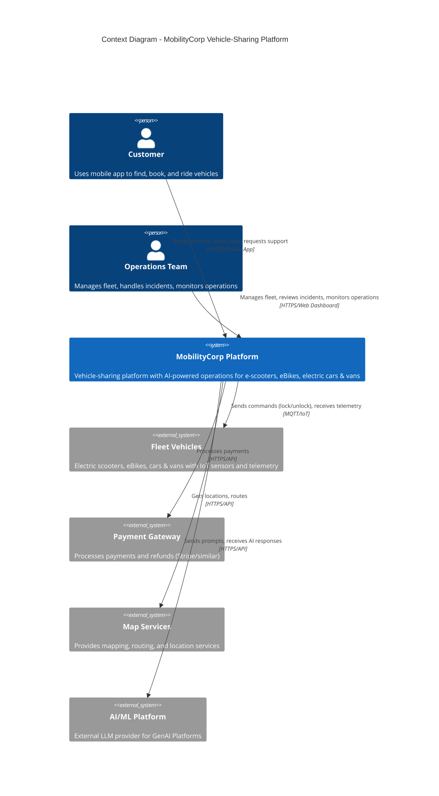

# Context Diagram - MobilityCorp System

## Description

This diagram shows the MobilityCorp vehicle-sharing platform in its external context, including all external actors and systems that interact with it. MobilityCorp supports electric scooters, eBikes, electric cars, and vans.

## Actors & External Systems

- **Customers**: Use mobile app to find, book, and use vehicles
- **Operations Team**: Manage fleet, handle incidents, monitor system health
- **Vehicles**: IoT-enabled electric scooters, eBikes, cars, and vans sending telemetry
- **Payment Gateway**: External payment processing (Stripe/similar)
- **Map Services**: External mapping and routing (Google Maps/similar)
- **AI/ML Platform**: External LLM provider for GenAI capabilities

## Diagram

## Key Interactions

1. **Customer Journey**: Customers interact with the mobile app to find nearby vehicles, make bookings, unlock vehicles, and request support
2. **Operations**: Operations team uses web dashboard to manage fleet distribution, respond to incidents, and monitor system health
3. **Vehicle Telemetry**: Vehicles continuously send location, battery status, and sensor data to the platform
4. **Payment Processing**: All financial transactions are handled through external payment gateway
5. **AI Enhancement**: GenAI capabilities are provided through integration with external LLM platform, used for conversational support, incident summarization, and anomaly explanation

## References

- See [Container Diagram](../container/container-diagram.md) for internal system structure
- See [ADR-002](../../../Architecture-Decision-Records/002-microservices-architecture) for architecture style decision
