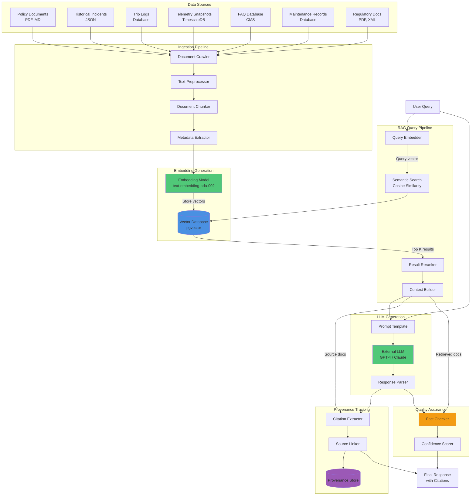

# RAG Data Flow Diagram - Retrieval-Augmented Generation

## Description

This diagram shows how data flows through the RAG (Retrieval-Augmented Generation) pipeline in the GenAI Platform. RAG ensures that all AI-generated responses are grounded in factual source documents, with complete provenance tracking for explainability and compliance.

## Purpose of RAG

- **Prevent Hallucination**: LLMs can generate plausible but false information. RAG constrains responses to retrieved factual sources.
- **Explainability**: Every claim can be traced back to a source document
- **Dynamic Updates**: Knowledge can be updated without retraining the LLM
- **Compliance**: EU AI Act requires explainable, auditable AI decisions

## Data Sources for RAG Index

1. **Policy Documents**: Pricing, terms of service, safety guidelines
2. **Historical Incidents**: Past issues and resolutions
3. **Trip Logs**: Anonymized trip data and patterns
4. **Telemetry Snapshots**: Vehicle sensor data archives
5. **FAQ Database**: Support knowledge base
6. **Maintenance Records**: Vehicle service history
7. **Regulatory Documents**: Compliance requirements

## Diagram



## Data Flow Steps

### Phase 1: Index Building (Offline)

#### 1. Document Ingestion

```javascript
// Document ingestion pipeline
async function ingestDocuments() {
  for (const document of dataSources) {
    // Extract text from various formats
    const text = await extractText(document);

    // Preprocess
    const cleaned = cleanText(text);
    const normalized = normalizeText(cleaned);

    // Chunk into manageable pieces
    const chunks = chunkDocument(normalized, {
      chunkSize: 512, // tokens
      overlap: 50, // token overlap for context
    });

    // Extract metadata
    for (const chunk of chunks) {
      const metadata = {
        source_id: document.id,
        source_type: document.type,
        created_at: document.timestamp,
        author: document.author,
        chunk_index: chunk.index,
        url: document.url,
      };

      // Generate embedding
      const embedding = await embeddingModel.encode(chunk.text);

      // Store in vector DB
      await vectorDb.upsert({
        id: chunk.id,
        vector: embedding,
        metadata: metadata,
        text: chunk.text,
      });
    }
  }
}
```

**Chunking Strategy:**

- **Size**: 512 tokens (~380 words)
- **Overlap**: 50 tokens between chunks (preserves context)
- **Hierarchy**: Preserve document structure (headers, sections)

#### 2. Embedding Generation

- **Model**: OpenAI text-embedding-ada-002 (1536 dimensions)
- **Alternative**: Open-source models (sentence-transformers)
- **Refresh**: Re-embed when documents change

### Phase 2: Query-Time Retrieval (Online)

#### 3. Query Processing

```javascript
async function retrieveContext(query, k = 5) {
  // Embed the query
  const queryVector = await embeddingModel.encode(query);

  // Semantic search
  const results = await vectorDb.search({
    vector: queryVector,
    k: k * 2, // Retrieve 2x for reranking
    threshold: 0.7, // Minimum similarity
  });

  // Rerank results (optional, improves accuracy)
  const reranked = await reranker.rerank({
    query: query,
    documents: results,
    k: k,
  });

  // Build context
  const context = [];
  for (const doc of reranked) {
    context.push({
      text: doc.text,
      source_id: doc.metadata.source_id,
      source_type: doc.metadata.source_type,
      relevance_score: doc.score,
      url: doc.metadata.url,
    });
  }

  return context;
}
```

**Search Parameters:**

- **K**: Top 5 most relevant chunks
- **Similarity**: Cosine similarity >0.7
- **Reranking**: Cross-encoder model for better relevance

#### 4. Context Assembly

```javascript
function buildPrompt(query, context) {
  let prompt = `You are a helpful assistant for MobilityCorp customer support.

Answer the user's question based ONLY on the provided context.
If the context doesn't contain enough information, say so.
Always cite your sources using [source_id].

Context:
`;

  context.forEach((doc, i) => {
    prompt += `\n[${i + 1}] (Source: ${doc.source_type})\n${doc.text}\n`;
  });

  prompt += `\nUser Question: ${query}\n\nAnswer:`;

  return prompt;
}
```

### Phase 3: Generation & Validation (Online)

#### 5. LLM Generation

```javascript
async function generateResponse(prompt) {
  const response = await llm.complete({
    prompt: prompt,
    temperature: 0.3, // Lower = more deterministic
    max_tokens: 500,
    stop_sequences: ["User Question:", "Context:"],
  });

  return response.text;
}
```

#### 6. Fact Checking

```javascript
function verifyFactuality(response, context) {
  // Extract claims from response
  const claims = extractClaims(response);

  // Check each claim against context
  let supportedClaims = 0;
  for (const claim of claims) {
    const isSupported = context.some((doc) =>
      claimMatchesContext(claim, doc.text)
    );
    if (isSupported) {
      supportedClaims++;
    }
  }

  const factualityRate = supportedClaims / claims.length;
  return factualityRate;
}
```

**Factuality Threshold**: ≥95% of claims must be supported

#### 7. Provenance Linking

```javascript
function linkSources(response, context) {
  // Find citations in response (e.g., [1], [2])
  const citations = extractCitations(response);

  const provenance = {
    response: response,
    sources: [],
    audit_trail: {
      query_time: Date.now(),
      retrieved_docs: context.length,
      citations_provided: citations.length,
    },
  };

  for (const citation of citations) {
    const idx = citation.index;
    const doc = context[idx];
    provenance.sources.push({
      citation_number: idx,
      source_id: doc.source_id,
      source_type: doc.source_type,
      url: doc.url,
      relevance_score: doc.relevance_score,
      excerpt: doc.text.substring(0, 200), // First 200 chars
    });
  }

  return provenance;
}
```

## Example: End-to-End Flow

### Input Query

"Why was my scooter locked automatically?"

### Step 1: Query Embedding

```
query_vector = [0.234, -0.567, 0.123, ..., 0.891]  # 1536 dims
```

### Step 2: Semantic Search

```
Retrieved chunks (sorted by relevance):

1. Score: 0.89 - safety_policy.pdf, page 12
   "Vehicles are automatically immobilized if battery drops below
   5% or if GPS indicates the vehicle is outside the service area..."

2. Score: 0.84 - incident_report_1234.json
   "Vehicle #4521 was auto-locked due to geofence violation..."

3. Score: 0.81 - faq_safety.md
   "Q: Why did my vehicle stop? A: For safety reasons, vehicles
   may auto-lock if they leave designated zones..."

4. Score: 0.78 - terms_of_service_v2.pdf
   "Users agree that MobilityCorp may remotely lock vehicles to
   ensure compliance with local regulations..."

5. Score: 0.75 - telemetry_log_trip_5678
   "Trip ended automatically: reason=geofence_exit, location=..."
```

### Step 3: Prompt Construction

```
You are a helpful assistant for MobilityCorp customer support.
Answer based ONLY on the provided context. Always cite sources.

Context:
[1] (Source: safety_policy)
Vehicles are automatically immobilized if battery drops below 5%...

[2] (Source: incident_report)
Vehicle #4521 was auto-locked due to geofence violation...

[... more context ...]

User Question: Why was my scooter locked automatically?

Answer:
```

### Step 4: LLM Response

```
Your scooter was automatically locked for safety reasons. This can
happen in several situations [1]:

1. Battery level dropped below 5% [1]
2. The vehicle detected it was outside the designated service area
   (geofence violation) [2][3]
3. Local regulations required the vehicle to stop [4]

Based on similar incidents [2], the most common cause is leaving the
approved riding zone. You can check your trip history in the app to
see your exact route and where the auto-lock occurred.

To avoid this in future, stay within the blue zones shown on the map
and keep an eye on battery levels before starting longer trips.
```

### Step 5: Fact Checking

```
Claims extracted:
✓ "Battery below 5% triggers auto-lock" → Supported by [1]
✓ "Geofence violation triggers auto-lock" → Supported by [2][3]
✓ "Local regulations may require stop" → Supported by [4]
✓ "Most common cause is geofence" → Supported by [2]

Factuality Rate: 4/4 = 100% ✓
```

### Step 6: Final Response with Provenance

```json
{
  "answer": "Your scooter was automatically locked...",
  "confidence": 0.94,
  "factuality": 1.0,
  "sources": [
    {
      "citation": "[1]",
      "title": "Safety Policy - Auto-Lock Conditions",
      "type": "policy",
      "url": "/policies/safety#auto-lock",
      "relevance": 0.89
    },
    {
      "citation": "[2]",
      "title": "Incident Report #1234",
      "type": "incident",
      "url": "/incidents/1234",
      "relevance": 0.84
    }
  ],
  "audit_id": "aud_rag_001"
}
```

## Vector Database Schema

```sql
-- pgvector schema
CREATE TABLE document_embeddings (
    id UUID PRIMARY KEY,
    embedding vector(1536),  -- OpenAI ada-002 dimensions
    text TEXT,
    source_id VARCHAR(255),
    source_type VARCHAR(50),
    source_url TEXT,
    created_at TIMESTAMP,
    updated_at TIMESTAMP,
    metadata JSONB,
    CONSTRAINT valid_source_type CHECK (
        source_type IN ('policy', 'incident', 'trip_log',
                       'telemetry', 'faq', 'maintenance', 'regulatory')
    )
);

-- Index for fast vector similarity search
CREATE INDEX ON document_embeddings
USING ivfflat (embedding vector_cosine_ops)
WITH (lists = 100);

-- Index for metadata filtering
CREATE INDEX ON document_embeddings USING gin(metadata);
```

## Index Maintenance

### Incremental Updates

- **Daily**: Add new incidents, trip logs, telemetry
- **Weekly**: Update FAQ, maintenance records
- **On-Change**: Policy updates, regulatory changes
- **Quarterly**: Full reindex with latest embedding model

### Quality Monitoring

- **Coverage**: % of queries with >3 relevant results
- **Relevance**: Human evaluation of top-K results
- **Freshness**: Age of indexed documents
- **Duplicate Detection**: Avoid redundant chunks

## Performance Characteristics

- **Index Size**: ~5M embeddings (~30GB)
- **Query Latency**:
  - Vector search: 50-100ms
  - Reranking: 100-150ms
  - Total RAG latency: 200-400ms
- **Embedding Cost**: ~$0.0001 per 1K tokens (OpenAI)
- **Storage**: pgvector on SSD storage

## Security & Privacy

- **PII Redaction**: Personal data anonymized before indexing
- **Access Control**: Index query logs monitored
- **Encryption**: Vectors encrypted at rest
- **Data Retention**: Old embeddings purged per policy

## References

- See [GenAI Component Diagram](../genai-subsystem/genai-component-diagram.md) for RAG components
- See [ADR-004](../../../Architecture-Decision-Records/004-rag-pattern-for-grounding.md) for RAG strategy rationale
- See [Conversational Support Flow](../sequence/conversational-support-flow.md) for RAG in action
- See [Data Architecture](../../../Data-Architecture/rag-index-strategy.md) for indexing details
