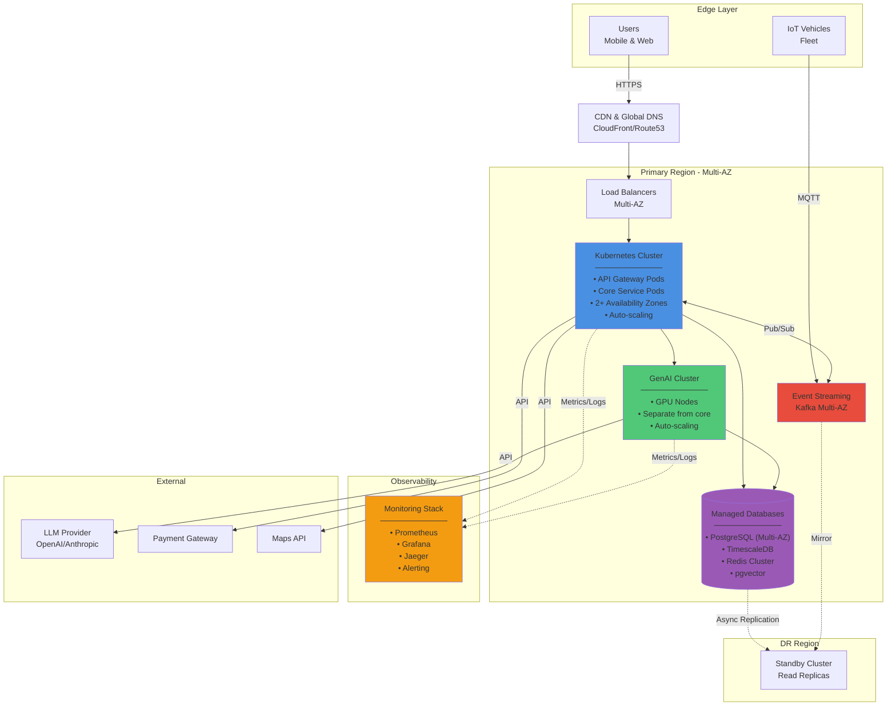

# Deployment Diagram - MobilityCorp Infrastructure

## Description

This diagram shows the cloud infrastructure deployment architecture for MobilityCorp. The system is designed for high availability with multi-region deployment, separate clusters for compute-intensive GenAI workloads, and comprehensive monitoring.

**Note:** Infrastructure components are shown as grouped boxes for clarity. Each represents multiple instances distributed across availability zones for high availability and fault tolerance.

## Infrastructure Components

### Compute

- **Primary Kubernetes Cluster**: Core application services
- **GenAI Kubernetes Cluster**: Separate cluster with GPU nodes for AI workloads
- **Auto-scaling Groups**: Dynamic scaling based on load

### Data Storage

- **Managed PostgreSQL**: Multi-AZ for high availability
- **TimescaleDB**: Time-series telemetry data
- **Redis Cluster**: Distributed caching
- **S3-compatible Storage**: Object storage for images, logs, backups

### Networking

- **CDN**: Static asset delivery and API caching
- **Load Balancers**: Multi-region traffic distribution
- **API Gateway**: Managed API gateway service

### Messaging & Events

- **Managed Kafka**: Event streaming platform
- **MQTT Broker**: IoT device communication

### Monitoring & Operations

- **Monitoring Stack**: Prometheus, Grafana, Jaeger
- **Log Aggregation**: Centralized logging
- **Alerting**: PagerDuty/similar integration

## Diagram



## Deployment Characteristics

### High Availability

- **Multi-AZ Deployment**: Services distributed across availability zones
- **Load Balancing**: Traffic distributed across healthy instances
- **Database Replication**: Synchronous replication within region
- **Auto-healing**: Kubernetes automatically restarts failed pods

### Disaster Recovery

- **Multi-Region**: Standby region for catastrophic failures
- **RPO**: 15 minutes (Recovery Point Objective)
- **RTO**: 30 minutes (Recovery Time Objective)
- **Data Replication**: Async replication to DR region

### Scalability

- **Horizontal Pod Autoscaling**: Based on CPU/memory/custom metrics
- **Cluster Autoscaling**: Adds nodes when needed
- **GenAI Scaling**: GPU nodes scale independently
- **Database**: Read replicas for read-heavy workloads

### Security

- **Network Isolation**: VPC with private subnets for databases
- **Encryption**: TLS in transit, encryption at rest
- **Secrets Management**: HashiCorp Vault or cloud KMS
- **IAM**: Least-privilege access controls
- **DDoS Protection**: Cloud-native DDoS mitigation

## Infrastructure as Code

All infrastructure is managed through:

- **Terraform**: Cloud resource provisioning
- **Helm Charts**: Kubernetes application deployment
- **GitOps**: Automated deployment via ArgoCD/Flux

## Monitoring & Observability

### Metrics (Prometheus)

- Service health and performance
- Request rates and latencies
- Error rates
- Business metrics (bookings, revenue)
- GenAI metrics (hallucination rate, HITL rate)

### Logging

- Centralized log aggregation
- Structured JSON logs
- Log retention: 90 days hot, 1 year cold storage

### Tracing (Jaeger)

- Distributed request tracing
- Performance bottleneck identification
- GenAI pipeline tracing

### Alerting

- PagerDuty for critical alerts
- Slack for warnings
- Alert rules for SLO violations

## Cost Optimization

### Compute

- **Spot Instances**: For non-critical workloads (dev/test)
- **Reserved Instances**: For baseline capacity (1-year commitment)
- **Right-sizing**: Regular review of instance sizes

### GenAI Specific

- **GPU Instance Management**: Scale down during off-peak hours
- **Model Caching**: Reduce LLM API calls via intelligent caching
- **Batch Processing**: Group non-urgent AI requests

### Storage

- **S3 Lifecycle Policies**: Move old logs to cheaper storage tiers
- **Database Optimization**: Regular vacuum and index optimization
- **CDN**: Reduce origin requests through aggressive caching

## Network Architecture

```
Internet
    ↓
CDN (Edge Locations)
    ↓
DNS / Global Load Balancer
    ↓
Regional Load Balancers
    ↓
API Gateway (Public Subnet)
    ↓
Application Layer (Private Subnet)
    ↓
Data Layer (Private Subnet - Isolated)
```

### Subnet Strategy

- **Public Subnets**: Load balancers, NAT gateways
- **Private App Subnets**: Application pods, no direct internet
- **Private Data Subnets**: Databases, most restricted
- **GenAI Subnets**: Isolated for sensitive AI workloads

## Deployment Regions & Capacity

### Primary Region (Region A)

- **Location**: EU-Central (for GDPR compliance) or US-East
- **Capacity**: Handles 100% of normal traffic
- **AZs**: 2 availability zones for redundancy

### DR Region (Region B)

- **Location**: Geographically distant from Region A
- **Capacity**: Can handle 50% of traffic immediately, scales to 100% in 30 min
- **Purpose**: Disaster recovery and compliance (data residency)

## References

- See [Container Diagram](../container/container-diagram.md) for what components are deployed
- See [ADR-002: Microservices Architecture](../../../Architecture-Decision-Records/002-microservices-architecture.md) for architecture decisions
