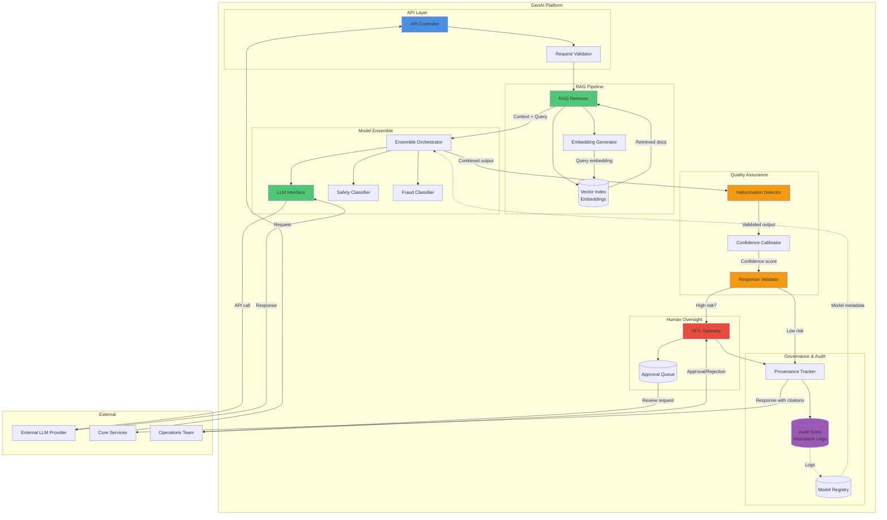

# GenAI Component Diagram - GenAI Platform Internals

## Description

This diagram shows the detailed internal components of the GenAI Platform, which provides AI-powered features while ensuring safety, explainability, and compliance. The service implements RAG (Retrieval-Augmented Generation), runtime validation, and Human-in-the-Loop controls.

## Key Components

### API Layer

- **API Controller**: REST endpoints for GenAI features
- **Request Validator**: Input validation and sanitization

### Core AI Pipeline

- **RAG Retriever**: Searches vector index for relevant context
- **Vector Index**: Stores embeddings of policies, incidents, telemetry
- **Model Ensemble**: Combines LLM with specialized classifiers
- **LLM Interface**: Communicates with external LLM provider
- **Specialized Classifiers**: Safety, fraud, license verification models

### Safety & Quality

- **Hallucination Detector**: Validates LLM claims against retrieved sources
- **Confidence Calibrator**: Produces calibrated uncertainty scores
- **Response Validator**: Enforces quality thresholds and acceptance criteria

### Human Oversight

- **HITL Gateway**: Routes high-risk decisions to human operators
- **Approval Queue**: Manages pending human approvals

### Governance

- **Audit Store**: Immutable logs of prompts, responses, decisions
- **Model Registry**: Tracks model versions, datasets, metrics
- **Provenance Tracker**: Links every output claim to source documents

## Diagram

## Component Responsibilities

### API Layer

- **API Controller**: Exposes endpoints for conversational support, incident summarization, anomaly explanation
- **Request Validator**: Sanitizes inputs to prevent prompt injection, validates request structure

### RAG Pipeline

- **RAG Retriever**: Performs semantic search over indexed documents to ground LLM responses
- **Vector Index**: Stores embeddings of:
  - Policy documents
  - Historical incidents
  - Trip logs and telemetry snapshots
  - FAQ and support knowledge base
- **Embedding Generator**: Converts text to vector embeddings for similarity search

### Model Ensemble

- **LLM Interface**: Manages communication with external LLM provider (e.g., GPT-4, Claude)
- **Specialized Classifiers**: Lightweight models for specific tasks:
  - Safety Classifier: Detects safety-critical situations
  - Fraud Classifier: Identifies suspicious patterns
- **Ensemble Orchestrator**: Combines outputs from multiple models, weights decisions

### Quality Assurance

- **Hallucination Detector**: Cross-checks LLM claims against retrieved sources, flags unsupported statements
- **Confidence Calibrator**: Converts raw model probabilities to calibrated confidence scores using temperature scaling
- **Response Validator**: Enforces runtime quality checks on outputs:
  - Factuality checks (≥95% claims must be supported)
  - Format validation
  - Safety constraints
  - Confidence threshold enforcement

### Human Oversight

- **HITL Gateway**: Routes high-risk actions to human operators:
  - Vehicle immobilization
  - Large refund approvals
  - Unusual safety incidents
- **Approval Queue**: Manages pending decisions requiring human review

### Governance

- **Audit Store**: Immutable log of:
  - All prompts and responses
  - Retrieved documents used
  - Confidence scores
  - Human approvals/rejections
  - Timestamps and user IDs
- **Model Registry**: Tracks:
  - Model versions and checksums
  - Training datasets
  - Evaluation metrics
  - Deployment history
- **Provenance Tracker**: Links every output claim to source documents for explainability

## Data Flow Example: Conversational Support Query

1. Customer asks: "Why was I charged $15?"
2. **API Controller** receives request
3. **Request Validator** sanitizes input
4. **RAG Retriever** searches vector index for:
   - Pricing policy documents
   - Customer's trip history
   - Relevant support articles
5. **Embedding Generator** converts query to vector
6. **Vector Index** returns top-5 relevant documents
7. **Ensemble Orchestrator** sends query + context to:
   - **LLM Interface** → External LLM
   - **Fraud Classifier** (checks if query seems suspicious)
8. **LLM** generates response with explanation
9. **Hallucination Detector** verifies all claims are backed by retrieved docs
10. **Confidence Calibrator** scores confidence at 97%
11. **Response Validator** checks factuality threshold (>95% ✓)
12. **Provenance Tracker** attaches citations to response
13. **Audit Store** logs entire interaction
14. Response returned to customer with citations

## Integration Points

- **Input**: API calls from Booking Service, Fleet Service, Customer Support
- **Output**: AI-generated responses with citations and confidence scores
- **Events**: Subscribes to Kafka events (incidents, anomalies, booking requests)
- **Storage**: Reads from all core service databases (read-only replicas) for RAG context

## Quality Metrics

- **Factuality Rate**: ≥95% (percentage of claims backed by sources)
- **Hallucination Rate**: <2.5%
- **HITL Approval Rate**: Tracked for model improvement
- **Latency**: <800ms for conversational queries (p95)
- **Confidence Calibration Error**: <5%

## References

- See [Container Diagram](../container/container-diagram.md) for how GenAI Platform fits in overall system
- See [RAG Data Flow](../data-flow/rag-data-flow.md) for detailed RAG pipeline
- See [ADR-004](../../../Architecture-Decision-Records/004-rag-strategy.md) for RAG strategy
- See [ADR-006](../../../Architecture-Decision-Records/006-hitl-strategy.md) for HITL approach
- See [ADR-006](../../../Architecture-Decision-Records/006-human-in-loop-gates.md) for HITL strategy
