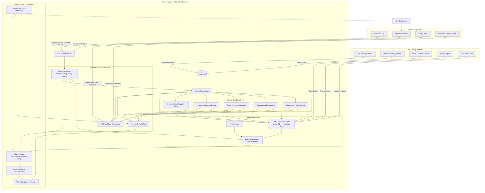

# GenAI Safety-First Bounded Context Diagram

This diagram visualizes the dedicated GenAI platform that MobilityCorp operates as an isolated, safety-first bounded context. It highlights the domain-specific capabilities, safety guardrails, supporting infrastructure, and compliance controls needed to deliver the intelligent customer support, safety management, incident intelligence, engagement personalization, and explainable pricing experiences promised in the architecture overview.

The diagram emphasizes the segregation of the GenAI subsystem with layered controls: a policy-enforcing API gateway, guardrails that mediate every model interaction, rich grounding data sources, and continuous assurance pipelines that sustain EU AI Act compliance. Human oversight, observability, and immutable auditing ensure high-risk GenAI behaviors remain transparent and governable while still enabling rapid delivery of intelligent mobility experiences.
