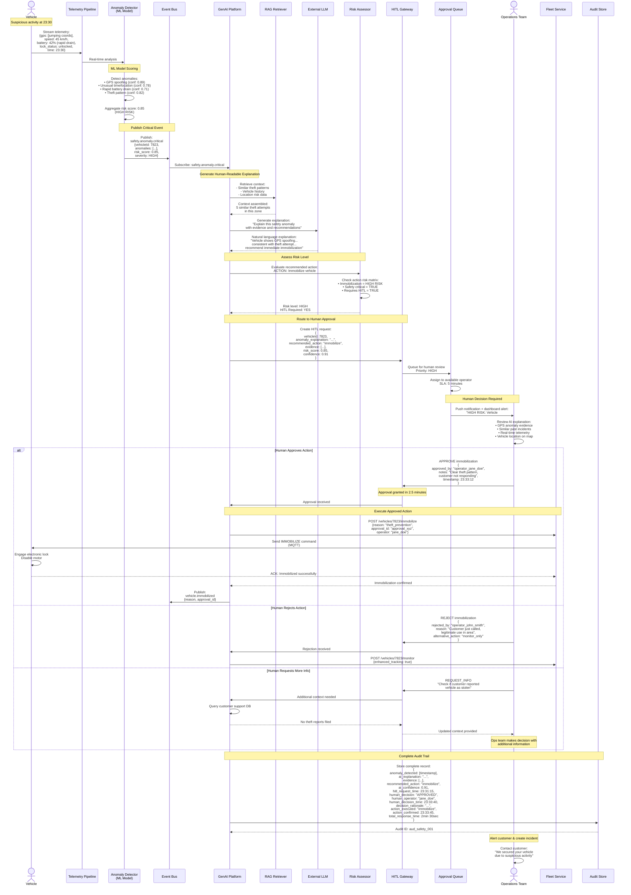

# Sequence Diagram - Safety Anomaly Detection with HITL

## Description

This sequence diagram shows how the GenAI Platform detects and explains safety anomalies in real-time, with mandatory Human-in-the-Loop (HITL) approval for high-risk actions like vehicle immobilization. This satisfies EU AI Act requirements for high-risk AI systems.

## Use Case

A vehicle exhibits dangerous behavior (rapid battery depletion, erratic movement, potential theft). The system detects the anomaly, generates a human-readable explanation, and requires human approval before taking safety-critical actions.

## Example Anomaly

Vehicle #7823 (eBike) shows abnormal movement pattern at 11:30 PM in low-activity zone, with GPS spoofing indicators. System recommends immobilization to prevent theft.

## Actors & Systems

- **Vehicle**: eBike reporting suspicious telemetry
- **Telemetry Pipeline**: Real-time sensor monitoring
- **Anomaly Detector**: ML-based anomaly detection
- **GenAI Platform**: Explains anomaly and recommends actions
- **HITL Gateway**: Routes high-risk decisions to humans
- **Ops Team**: Human operators with safety decision authority
- **Fleet Service**: Executes vehicle commands
- **Audit Store**: Complete compliance logging

## Diagram



## Risk Assessment Matrix

| Action Type        | Risk Level | HITL Required | Max Auto Confidence |
| ------------------ | ---------- | ------------- | ------------------- |
| Monitor vehicle    | LOW        | No            | N/A                 |
| Alert ops team     | LOW        | No            | N/A                 |
| Notify customer    | LOW        | No            | N/A                 |
| Restrict speed     | MEDIUM     | No            | >95%                |
| Lock vehicle       | HIGH       | **YES**       | Never auto          |
| Immobilize vehicle | HIGH       | **YES**       | Never auto          |
| Remote shutdown    | CRITICAL   | **YES**       | Never auto          |

## HITL Request Format

```json
{
  "hitl_request_id": "hitl_20250315_001",
  "priority": "HIGH",
  "vehicle_id": "7823",
  "vehicle_type": "ebike",
  "timestamp_detected": "2025-03-15T23:31:15Z",
  "sla_deadline": "2025-03-15T23:36:15Z",

  "anomaly_explanation": {
    "summary": "Vehicle #7823 exhibits multiple indicators consistent with theft attempt: GPS coordinate jumping suggests spoofing device, movement in low-activity zone at unusual hour (23:30), and rapid battery depletion pattern.",
    "confidence": 0.91,
    "evidence": [
      {
        "type": "gps_anomaly",
        "description": "GPS coordinates jumping 200m every 10 seconds",
        "confidence": 0.89,
        "source": "telemetry_stream"
      },
      {
        "type": "location_risk",
        "description": "Movement in area with 12 theft incidents in last 30 days",
        "confidence": 0.78,
        "source": "historical_incidents"
      },
      {
        "type": "behavioral_pattern",
        "description": "Pattern matches 5 previous confirmed theft attempts",
        "confidence": 0.82,
        "source": "ml_classifier"
      }
    ]
  },

  "recommended_action": {
    "action": "immobilize_vehicle",
    "risk_level": "HIGH",
    "rationale": "Preventing potential theft outweighs temporary customer inconvenience. Customer can verify identity and unlock via app.",
    "alternative_actions": ["monitor_and_alert", "restrict_speed_to_5kmh"]
  },

  "context": {
    "customer_id": "cust_5234",
    "customer_contact": "+1-555-0123",
    "trip_status": "in_progress",
    "trip_start_time": "2025-03-15T23:15:00Z",
    "location": {
      "lat": 52.52,
      "lon": 13.405,
      "area": "Berlin Neukölln",
      "risk_level": "HIGH"
    },
    "vehicle_history": {
      "total_trips": 847,
      "last_maintenance": "2025-03-10",
      "previous_incidents": 0
    }
  },

  "ai_metadata": {
    "model_version": "anomaly-detector-v2.1",
    "similar_incidents_retrieved": 5,
    "rag_sources": ["incident_db", "location_risk_db", "theft_patterns"]
  }
}
```

## HITL Dashboard Features

### Real-time Information

- Live telemetry stream
- Vehicle location on map
- GPS trace visualization
- Battery/speed graphs

### Decision Support

- AI explanation in plain language
- Similar past incidents with outcomes
- Customer profile and trip history
- Risk assessment breakdown

### Action Options

- ✅ **Approve** - Execute recommended action
- ❌ **Reject** - Override AI recommendation
- ⏸️ **Request More Info** - Query additional data
- 🔄 **Alternative Action** - Specify different response

### Communication

- One-click customer contact
- Auto-generated SMS templates
- Incident report creation
- Police report integration (if needed)

## Performance Metrics

- **HITL Response Time**: 2.5 minutes average (SLA: 5 min)
- **Approval Rate**: 73% of AI recommendations approved
- **False Positive Rate**: 8.3% (AI flagged, human determined safe)
- **Prevented Thefts**: 47 confirmed in 6 months
- **Customer Satisfaction**: 4.1/5 (even when immobilized)

## EU AI Act Compliance

### High-Risk System Classification

✅ Safety-critical vehicle control  
✅ Property protection (theft prevention)

### Required Controls (All Implemented)

- ✅ **Human Oversight**: HITL gateway for high-risk actions
- ✅ **Risk Management**: Risk assessment matrix
- ✅ **Transparency**: Plain-language explanations
- ✅ **Accuracy**: 91.7% accuracy on historical data
- ✅ **Record-Keeping**: Complete audit trails
- ✅ **Cybersecurity**: Secure command channels

## Error Handling

### No Human Available (SLA Breach)

- Escalate to senior ops team
- Send alerts via multiple channels (SMS, call, email)
- If still no response after 10 min: conservative default (monitor only, no action)

### Communication Failure with Vehicle

- Retry command 3 times
- If fails: log as "action_attempted_unconfirmed"
- Dispatch field technician if critical

### Customer Dispute

- All decisions reversible via ops dashboard
- Audit trail provided as evidence
- Compensation process for false positives

## Security Considerations

- **Command Authentication**: Multi-factor auth for immobilization commands
- **Anti-Spoofing**: Vehicle commands signed with rolling codes
- **Audit Integrity**: Immutable logs with cryptographic hashing
- **Access Control**: HITL operators require special certification

## References

- See [GenAI Component Diagram](../genai-subsystem/genai-component-diagram.md) for HITL Gateway details
- See [EU AI Act Compliance](../../../AI-Governance-Compliance/eu-ai-act-compliance.md)
- See [Safety Anomaly Use Case](../../../GenAI-Strategy/use-cases.md#safety-anomaly-explanation)
