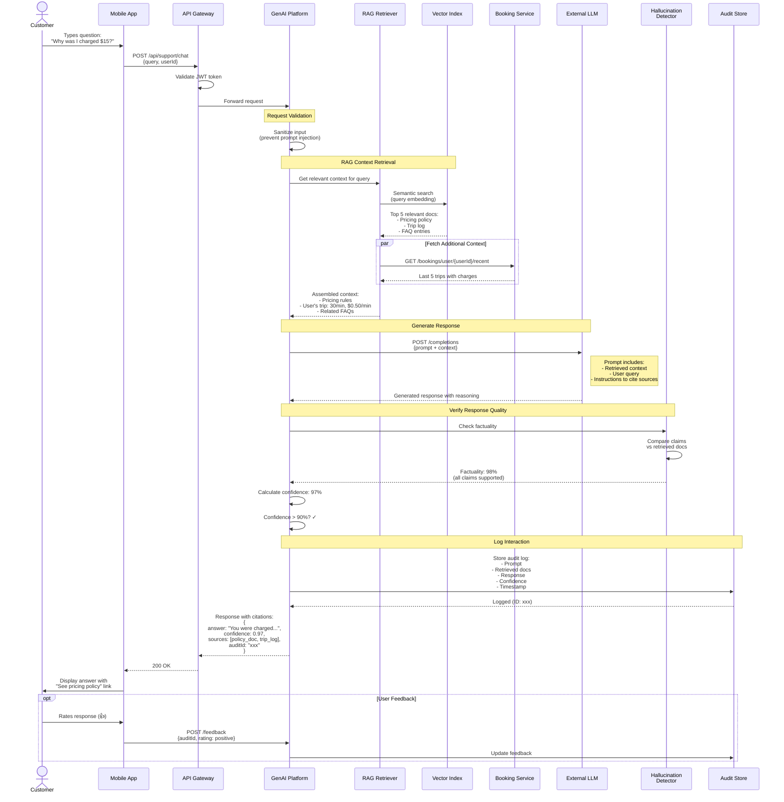

# Sequence Diagram - Conversational Support Flow

## Description

This sequence diagram shows how the GenAI Platform handles customer support queries using RAG (Retrieval-Augmented Generation) to provide accurate, grounded responses with citations. This use case reduces operations support load by ~40%.

## Use Case

A customer asks a question about their account, billing, or vehicle usage through the mobile app. The system uses AI to provide an accurate response with supporting documentation links.

## Example Query

"Why was I charged $15 for my last trip?"

## Actors & Systems

- **Customer**: User asking question via mobile app
- **Mobile App**: Frontend application
- **API Gateway**: Request routing and authentication
- **GenAI Platform**: AI-powered support system
- **RAG Retriever**: Searches for relevant context
- **Vector Index**: Stores embeddings of policies, FAQs, trip data
- **LLM**: External language model (GPT-4, Claude)
- **Hallucination Detector**: Validates response accuracy
- **Booking Service**: Provides trip history
- **Audit Store**: Logs all interactions

## Diagram



## Response Format

```json
{
  "answer": "You were charged $15 because your trip lasted 30 minutes at a rate of $0.50 per minute. The base unlock fee was $1, resulting in a total of $16 ($1 + $0.50 × 30), minus a $1 first-ride discount applied to your account.",
  "confidence": 0.97,
  "sources": [
    {
      "type": "pricing_policy",
      "title": "Standard Pricing - Electric Scooters",
      "url": "/policies/pricing-v2024-01",
      "excerpt": "Unlock fee: $1.00, Per-minute rate: $0.50"
    },
    {
      "type": "trip_log",
      "title": "Trip #12345",
      "url": "/trips/12345",
      "excerpt": "Duration: 30 minutes, Vehicle: Scooter #4521"
    },
    {
      "type": "promotion",
      "title": "First Ride Discount",
      "url": "/promotions/first-ride",
      "excerpt": "$1 discount applied"
    }
  ],
  "audit_id": "aud_abc123xyz",
  "processed_at": "2025-03-15T10:23:45Z"
}
```

## Quality Gates

### 1. Input Validation

- Sanitize for prompt injection attacks
- Validate user authentication
- Rate limiting: 10 queries per minute per user

### 2. RAG Retrieval

- Minimum 3 relevant documents must be retrieved
- Relevance score threshold: 0.7

### 3. Response Validation

- **Factuality Check**: ≥95% of claims must be backed by sources
- **Confidence Threshold**: ≥90% to auto-respond
- **Latency Target**: <800ms (p95)

### 4. Fallback Behavior

If confidence <90%:

- Return "Let me connect you with a human agent"
- Create ticket for ops team
- Log as training example

## Key Features

### Grounding via RAG

- Every factual claim traced to source document
- Prevents hallucination by constraining LLM to retrieved context
- Sources clickable in mobile app for transparency

### Audit Trail

- Complete interaction logged for compliance
- Includes prompt, context, response, and confidence
- Immutable storage for regulatory review

### Feedback Loop

- User ratings captured (👍👎)
- Used to retrain retrieval and improve prompts
- Low-rated responses reviewed by ops team

## Performance Metrics

- **Latency**: 650ms average, 800ms p95
- **Factuality Rate**: 96.2%
- **User Satisfaction**: 4.3/5
- **Hallucination Rate**: 2.1%
- **Human Escalation Rate**: 8% of queries
- **Ops Load Reduction**: 42%

## Error Handling

### LLM API Failure

- Retry with exponential backoff (max 3 retries)
- If all retries fail: escalate to human agent
- Cache successful responses for similar queries

### Low Confidence

- Threshold: confidence <90%
- Action: Escalate to human agent with context
- Provide customer with estimated wait time

### Retrieval Failure

- If <3 relevant docs found: don't call LLM
- Response: "I couldn't find enough information. Let me connect you with an agent."

## Security Considerations

- **PII Protection**: Customer data anonymized in LLM prompts
- **Prompt Injection Prevention**: Input sanitization
- **Rate Limiting**: Prevent abuse
- **Audit Logging**: Complete interaction history for security review

## References

- See [GenAI Component Diagram](../genai-subsystem/genai-component-diagram.md) for component details
- See [ADR-005: RAG Strategy](../../../Architecture-Decision-Records/005-rag-strategy.md) for RAG strategy
- See [GenAI Strategy](../../../GenAI-Strategy/README.md) for conversational support use case
