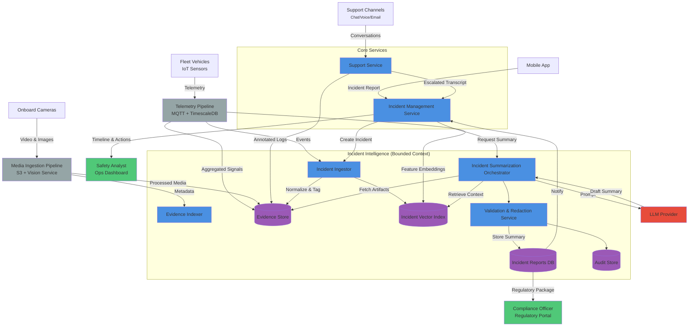

# Incident Summarization

Manual incident investigations often require safety analysts to pull telemetry, support transcripts, and media from disparate tools. This slows down response times, creates inconsistent documentation, and increases the risk of missing compliance-critical details.

Incident summarization orchestrates multi-modal evidence ingestion with retrieval-augmented generation (RAG) to automatically produce a consistent timeline, root-cause clues, and recommended next actions minutes after an incident is reported.

The following evidence streams feed the summarization pipeline:

Related requirement: [REQ-AI-004 Automated incident summarization](../../../Problem-Context/requirements.md#incident-management)

- Real-time telemetry (speed, acceleration, brake events, tilt) from vehicle IoT devices
- Edge safety detections (fall detection, helmet absence, collision alerts) emitted by vision and anomaly models
- Customer and witness interactions (support transcripts, voice call recordings, chat logs)
- Photos and video attachments captured by riders, field crews, or onboard cameras
- Environmental context (weather, traffic advisories, geofence rules) to explain contributing factors

Incident summarization delivers the following outcomes:

- Generates a standardized incident brief (timeline, contributing factors, recommended mitigations) in under 10 minutes
- Flags compliance and insurance requirements with citations back to the originating evidence
- Highlights follow-up tasks for operations (vehicle recovery, customer outreach, maintenance checks)
- Feeds an incident knowledge base to surface emerging risks and inform future policy updates

## How it works

1. Telemetry, diagnostic events, and AI-triggered safety alerts stream through the **telemetry pipeline**, which normalizes and stores raw signals for downstream retrieval.
2. Media ingestion services process uploaded photos, dashcam footage, and sensor snapshots, running CV pipelines to extract labels and transcripts before archiving artifacts in an **evidence store**.
3. When an incident is opened in the **incident management service**, the **incident ingestor** collects related evidence, tags it, and publishes metadata into the **incident vector index**.
4. The **incident summarization orchestrator** performs RAG retrieval over the index, assembles a structured prompt, and calls the external LLM provider to generate a draft timeline with cited references.
5. A **validation and redaction service** verifies factual claims against the evidence set, redacts PII, stores the approved summary in the **incident reports database**, and notifies safety and compliance teams.

The following diagram illustrates the cooperation between components:

## References

- See [GenAI Component Diagram](../genai-subsystem/genai-component-diagram.md) for component details
- See [Incident management requirements](../../../Problem-Context/requirements.md#incident-management) for requirements details
- See [GenAI Strategy](../../../GenAI-Strategy/README.md) for conversational support use case
